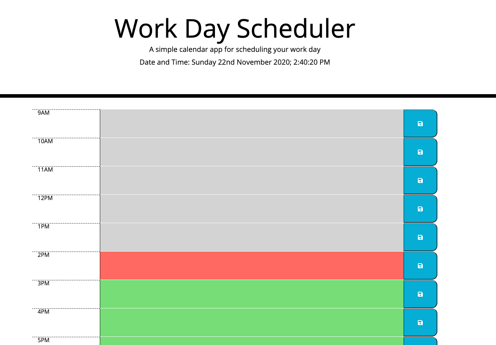

# Work Day Scheduler

Using HTML, CSS and jQuery in this project, I managed to create a Work Day Scheduler that allows the user to save events for each hour of the day. The app runs in the browser and uses an external library to update the date and time of the app. Colour coded blocks are used to help the user differentiate whether an event is in the past, present or future.

The link to the webpage https://vianneyk.github.io/Third-Party-Apis/
